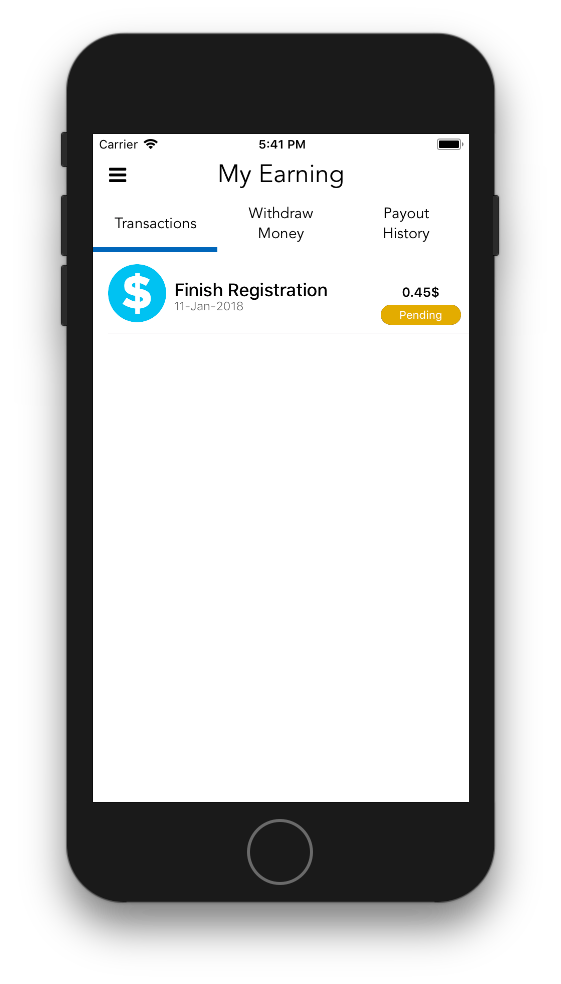
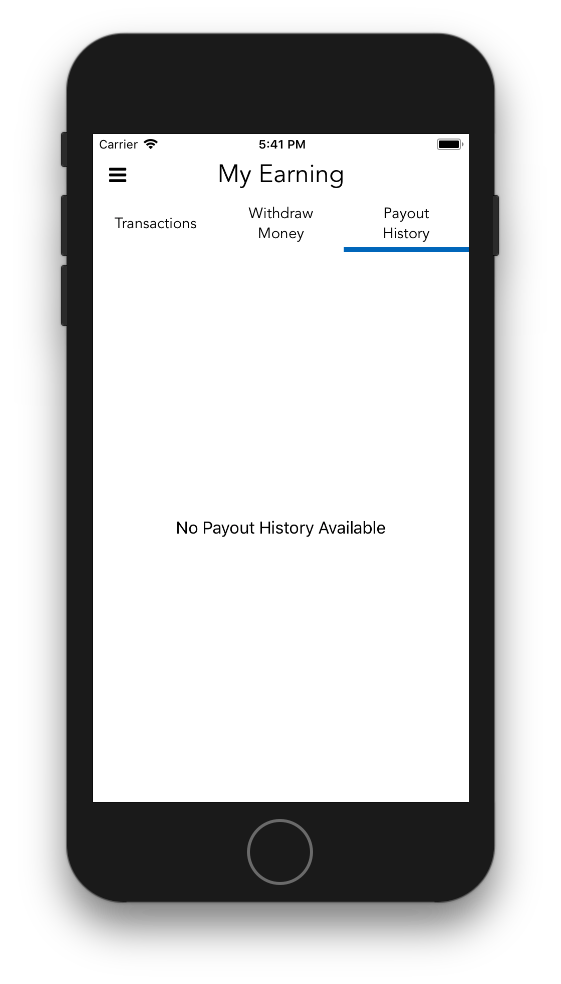
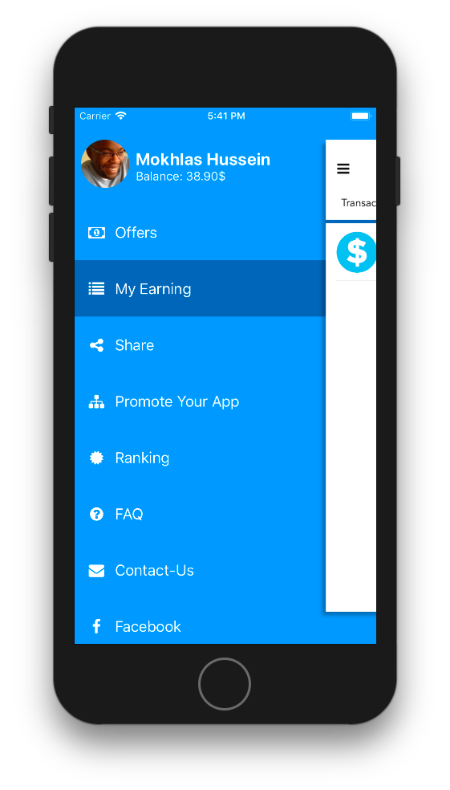
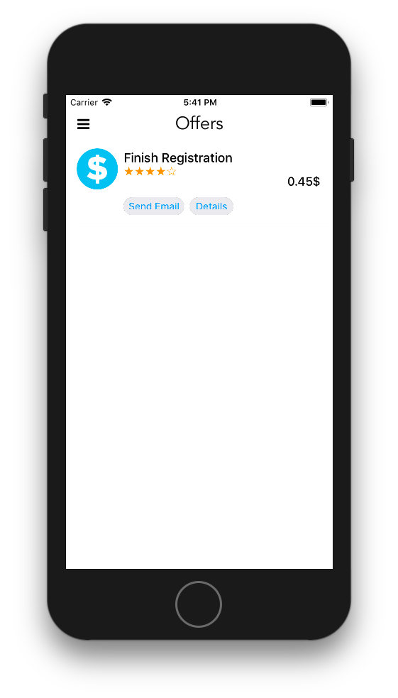
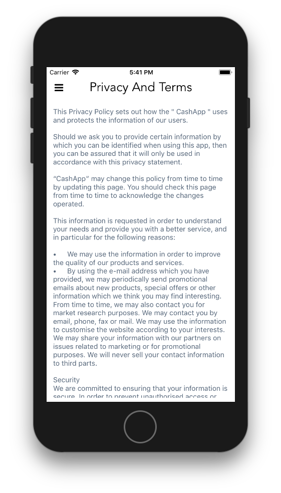
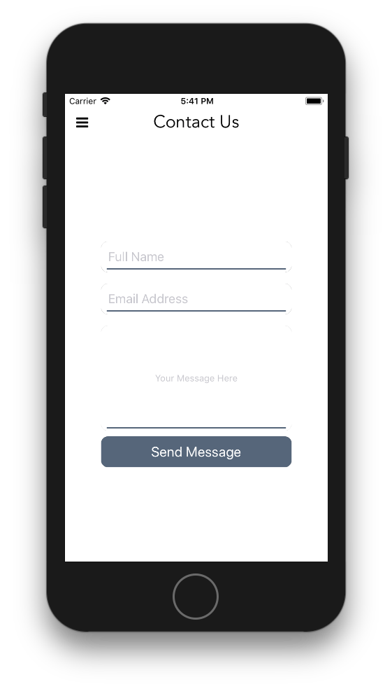
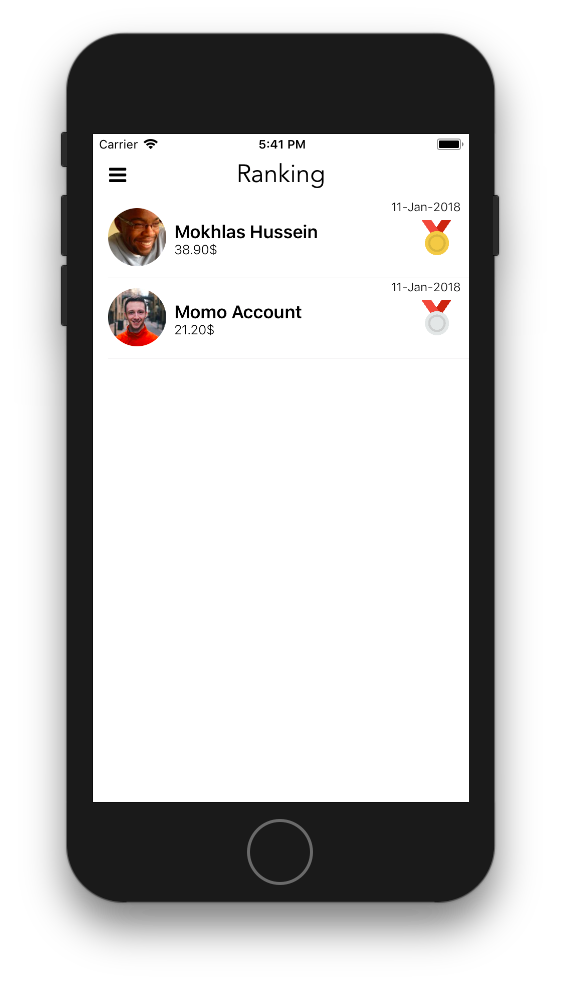

# CashApp
working demo using CoreData for CashApp Alternative

### Demo

https://appetize.io/app/p740nquu10hnnvd899v5tqyy48?device=iphonex&scale=75&orientation=portrait&osVersion=11.1&deviceColor=black

### Screenshots

<h3 align="center">

</h3>
<h3 align="center">

</h3>
<h3 align="center">

</h3>
<h3 align="center">

</h3>
<h3 align="center">

</h3>
<h3 align="center">

</h3>
<h3 align="center">

</h3>
<h3 align="center">

</h3>

## Security

If you discover any security related issues, please email imokhles@imokhles.com instead of using the issue tracker.

## Credits

- [iMokhles](http://github.com/imokhles)

## License

The GNU General Public License v3.0 LICENSE License. Please see [License File](LICENSE) for more information.
